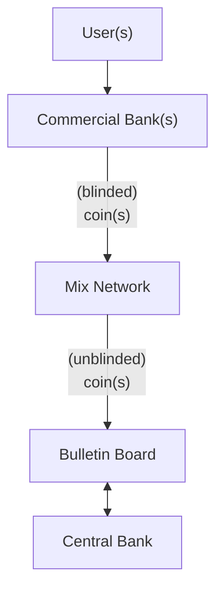

# e-cash3.0
New PQ E-Cash protocol

## Protocol Flow

```mermaid
---
config:
  layout: elk
---
flowchart TD
    user["User(s)"]

    commercial_bank["Commercial Bank(s)"]

    board["Bulletin Board"]
    central_bank["Central Bank"]

    mix_network["Mix Network"]

    
    user -->  commercial_bank
    commercial_bank --"(blinded)<br>coin(s)"-->  mix_network
    mix_network     --"(unblinded)<br>coin(s)"-->  board
    board           <--> central_bank

```
